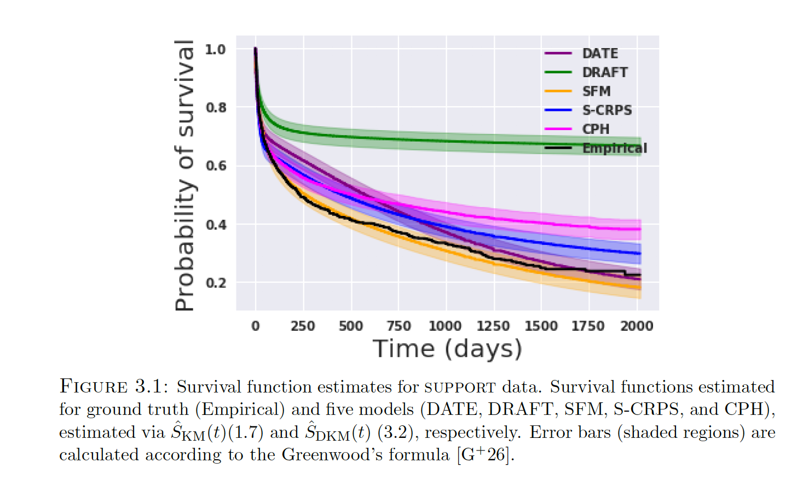

# Calibration and Uncertainty in Neural Time-to-Event Modeling (IEEE TNNLS 2020)
This repository contains links to TensorFlow code for replicating experiments in our journal article [Calibration and Uncertainty in Neural Time-to-Event Modeling](https://ieeexplore.ieee.org/document/9244076) to appear as a <em>Special Issue: Robust Learning of Spatio-Temporal Point Processes: Modeling, Algorithm, and Applications</em> at IEEE TNNLS 


```latex
@article{chapfuwa2020calibration,
  title={Calibration and Uncertainty in Neural Time-to-Event Modeling},
  author={Chapfuwa, Paidamoyo and Tao, Chenyang and Li, Chunyuan and Khan, Irfan and Chandross, Karen J and Pencina, Michael J and Carin, Lawrence and Henao, Ricardo},
  journal={IEEE Transactions on Neural Networks and Learning Systems},
  year={2020},
  publisher={IEEE}
}
```
## Calibration in Time-to-Event Models
- We propose a new estimator   that can be used to visually assess the calibration (accounting for model uncertainty) of estimated event times from
different models relative to the ground truth  

- Run the [Calibration.ipynb](https://github.com/paidamoyo/survival_cluster_analysis/blob/master/Calibration.ipynb) to generate calibration results

## Proposed Models

We propose the following models implemented here:
- An AFT plus ranking baseline [DRAFT](https://github.com/paidamoyo/adversarial_time_to_event/blob/master/train_draft.py)
- An adversarial nonparametric model [DATE](https://github.com/paidamoyo/adversarial_time_to_event/blob/master/train_date.py)
- We also consider replacing the discriminator of the adversarial nonparametric model with a survival-function
matching estimator [SFM](https://github.com/paidamoyo/survival_cluster_analysis/blob/master/utils/calibration.py) that accounts for model calibration

## Acknowledgments
This work leverages the accuracy objective from [DATE](https://arxiv.org/pdf/1804.03184.pdf). Contact [Paidamoyo](https://github.com/paidamoyo) for issues relevant to this project.
